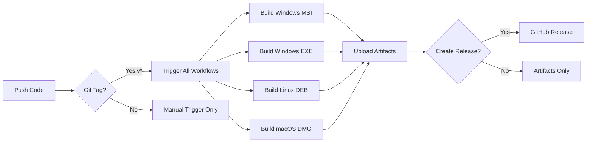

# 🔨 Build Instructions

Complete guide for building Direct Print Server for all platforms.

---

## 📋 Prerequisites

### Required
- **Node.js 20 LTS** or higher
- **npm** (comes with Node.js)
- **Git**

### Platform-Specific Tools

#### Windows
- **WiX Toolset v3.11** (for MSI installer)
  ```powershell
  choco install wixtoolset -y
  ```

#### macOS
- **Xcode Command Line Tools**
  ```bash
  xcode-select --install
  ```
- **create-dmg** (for DMG creation)
  ```bash
  brew install create-dmg
  ```

#### Linux (Debian/Ubuntu)
- **dpkg-dev** and **fakeroot**
  ```bash
  sudo apt-get install dpkg-dev fakeroot
  ```

---

## 🚀 Quick Build

### Local Development Build

```bash
# 1. Clone repository
git clone https://github.com/aiqbalsyah/direct-print-utils-pos.git
cd direct-print-utils-pos

# 2. Install dependencies
npm install

# 3. Install @yao-pkg/pkg globally (Node 20 support)
npm install -g @yao-pkg/pkg

# 4. Build for your platform
npm run build-win      # Windows executable
npm run build-mac      # macOS executable
npm run build-linux    # Linux executable
npm run build-all      # All platforms
```

**Output:** `dist/` directory with executables

**Note:** We use `@yao-pkg/pkg` instead of `vercel/pkg` because it supports Node 20 LTS.

---

## 🪟 Windows Builds

### 1. Windows Executable (.exe)

**Manual Build:**
```bash
npm run build-win
# Output: dist/direct-print-win.exe
```

**GitHub Actions:**
- Workflow: `.github/workflows/build-exe.yml`
- Trigger: Manual dispatch
- Artifact: `direct-print-executable-{sha}`

### 2. Windows MSI Installer

**Local Build:**
```bash
# Requires WiX Toolset
npm install
build-complete.bat

# MSI will be created: DirectPrintServer.msi
```

**GitHub Actions:**
- Workflow: `.github/workflows/build-msi.yml`
- Trigger: Manual dispatch or git tag `v*`
- Artifact: `direct-print-msi-{sha}`

**Features:**
- ✅ Professional Windows installer
- ✅ Windows Service integration
- ✅ Start Menu shortcuts
- ✅ Add/Remove Programs entry
- ✅ Auto-start on boot
- ✅ UAC elevation enforcement

---

## 🐧 Linux Builds

### 1. Linux Executable

**Manual Build:**
```bash
npm run build-linux
# Output: dist/direct-print-linux
```

### 2. Debian Package (.deb)

**GitHub Actions:**
- Workflow: `.github/workflows/build-linux-deb.yml`
- Trigger: Manual dispatch or git tag `v*`
- Artifact: `direct-print-linux-deb-{sha}`

**Package Contents:**
```
/usr/local/bin/direct-print-server              # Main executable
/etc/systemd/system/direct-print-server.service # Systemd service
/usr/share/applications/direct-print-server.desktop
/usr/share/doc/direct-print-server/README
```

**Installation:**
```bash
sudo dpkg -i direct-print-server_1.0.0_amd64.deb
```

**Features:**
- ✅ Systemd service integration
- ✅ Auto-start on boot
- ✅ Desktop entry
- ✅ Post-install scripts
- ✅ Clean uninstall

**Supported Distributions:**
- Ubuntu 20.04+ (Focal, Jammy, Noble)
- Debian 10+ (Buster, Bullseye, Bookworm)
- Linux Mint 20+
- Pop!_OS 20.04+

---

## 🍎 macOS Builds

### 1. macOS Executable

**Manual Build:**
```bash
npm run build-mac
# Output: dist/direct-print-macos
```

### 2. macOS DMG Package

**GitHub Actions:**
- Workflow: `.github/workflows/build-macos-dmg.yml`
- Trigger: Manual dispatch or git tag `v*`
- Artifact: `direct-print-macos-dmg-{sha}`

**Package Contents:**
```
DirectPrintServer.app/                           # Application bundle
  Contents/
    MacOS/DirectPrintServer                      # Executable
    Resources/                                   # Assets
    Library/LaunchAgents/                        # Auto-start config
    Info.plist                                   # Bundle info
install.sh                                       # Installation script
uninstall.sh                                     # Removal script
README.txt                                       # Documentation
```

**Installation:**
```bash
# Automated
sudo bash install.sh

# Manual
cp -R DirectPrintServer.app /Applications/
```

**Features:**
- ✅ Native .app bundle
- ✅ LaunchAgent integration
- ✅ Auto-start on login
- ✅ Drag-and-drop DMG installer
- ✅ Installation/uninstallation scripts

**Supported macOS Versions:**
- macOS 15 Sequoia
- macOS 14 Sonoma
- macOS 13 Ventura
- macOS 12 Monterey
- macOS 11 Big Sur
- macOS 10.15 Catalina
- macOS 10.14 Mojave
- macOS 10.13 High Sierra

---

## 📦 GitHub Actions Workflows

### Available Workflows

| Workflow | File | Platform | Output |
|----------|------|----------|--------|
| **Build Windows EXE** | `build-exe.yml` | Windows | `.exe` |
| **Build Windows MSI** | `build-msi.yml` | Windows | `.msi` |
| **Build Linux DEB** | `build-linux-deb.yml` | Linux | `.deb` |
| **Build macOS DMG** | `build-macos-dmg.yml` | macOS | `.dmg` |

### Triggering Workflows

#### Manual Trigger (ONLY Method)

**⚠️ IMPORTANT: All workflows are MANUAL TRIGGER ONLY - no automatic triggers**

1. Go to **Actions** tab on GitHub
2. Select workflow (e.g., "Build Linux DEB Package")
3. Click **"Run workflow"**
4. ✅ Check **"Create GitHub Release (requires git tag v*)"** if you want to publish release
5. Click **"Run workflow"** button

**Note:**
- Workflows will NOT trigger automatically on git push or tag creation
- You MUST manually trigger each workflow from GitHub Actions tab

#### Creating GitHub Release

GitHub Release will ONLY be created if **BOTH** conditions are met:

1. ✅ Checkbox **"Create GitHub Release"** is checked when triggering workflow
2. ✅ Current commit has a git tag starting with `v*` (e.g., `v1.0.0`)

**Example:**
```bash
# 1. Create and push tag
git tag v1.0.0
git push origin v1.0.0

# 2. Go to GitHub Actions tab
# 3. Manually trigger desired workflow
# 4. Check "Create GitHub Release" checkbox
# 5. Release will be created with tag v1.0.0

# If no git tag exists, workflow runs but release is NOT created
```

### Workflow Inputs

All workflows support:
- `create_release` (boolean): Create GitHub Release after build

### Artifacts

All workflows upload artifacts with 90-day retention:
- `direct-print-executable-{sha}` - Windows EXE
- `direct-print-msi-{sha}` - Windows MSI
- `direct-print-linux-deb-{sha}` - Linux DEB
- `direct-print-macos-dmg-{sha}` - macOS DMG

---

## 🏗️ Build Configuration

### package.json

```json
{
  "name": "direct_print_js",
  "version": "1.0.0",
  "engines": {
    "node": ">=20.0.0"
  },
  "scripts": {
    "build-win": "pkg . --targets node20-win-x64 --output ./dist/direct-print-win.exe",
    "build-mac": "pkg . --targets node20-macos-x64 --output ./dist/direct-print-macos",
    "build-linux": "pkg . --targets node20-linux-x64 --output ./dist/direct-print-linux",
    "build-all": "npm run build-win && npm run build-mac && npm run build-linux"
  },
  "pkg": {
    "targets": [
      "node20-mac-x64",
      "node20-win-x64",
      "node20-linux-x64"
    ],
    "assets": [
      "public/**/*",
      "src/**/*"
    ]
  }
}
```

### pkg Options

- **Targets**: Node 20 runtime for all platforms
- **Assets**: Includes `public/` and `src/` directories
- **Output**: Single executable per platform

---

## 🧪 Testing Builds

### Test Executable

```bash
# Windows
dist/direct-print-win.exe

# macOS
./dist/direct-print-macos

# Linux
./dist/direct-print-linux
```

**Expected Output:**
```
🚀 Direct Print Server Starting...
🖨️  Printer Detection: System printers available
🌐 Server running on http://localhost:4000
✅ Press Ctrl+C to stop
```

### Test Packages

#### Windows MSI
```powershell
# Right-click MSI → Run as administrator
# Or command line:
msiexec /i DirectPrintServer.msi /l*v install.log
```

#### Linux DEB
```bash
# Install
sudo dpkg -i direct-print-server_1.0.0_amd64.deb

# Verify
systemctl status direct-print-server
curl http://localhost:4000
```

#### macOS DMG
```bash
# Mount DMG
open DirectPrintServer-1.0.0.dmg

# Install
sudo bash install.sh

# Verify
launchctl list | grep directprintserver
curl http://localhost:4000
```

---

## 🐛 Troubleshooting

### Build Errors

#### "pkg not found"
```bash
npm install -g @yao-pkg/pkg
```

#### "WiX Toolset not found" (Windows)
```powershell
choco install wixtoolset -y
# Add to PATH: C:\Program Files (x86)\WiX Toolset v3.11\bin
```

#### "create-dmg not found" (macOS)
```bash
brew install create-dmg
```

#### "dpkg-deb not found" (Linux)
```bash
sudo apt-get install dpkg-dev fakeroot
```

### Runtime Errors

#### Port 4000 already in use
```bash
# Find and kill process
# Windows
netstat -ano | findstr :4000
taskkill /PID <PID> /F

# macOS/Linux
lsof -ti:4000 | xargs kill -9
```

#### No printers detected
- **Windows**: Check "Printers & scanners" settings
- **macOS**: Check System Preferences → Printers & Scanners
- **Linux**: Run `lpstat -p -d` to verify CUPS setup

---

## 📊 Build Matrix

| Platform | Executable | Installer | Service | Auto-start |
|----------|-----------|-----------|---------|------------|
| **Windows** | ✅ .exe | ✅ .msi | ✅ Windows Service | ✅ Yes |
| **macOS** | ✅ Binary | ✅ .dmg | ✅ LaunchAgent | ✅ Yes |
| **Linux** | ✅ Binary | ✅ .deb | ✅ Systemd | ✅ Yes |

---

## 🔄 CI/CD Pipeline



---

## 📚 Additional Resources

### Documentation
- [README.md](README.md) - Main documentation
- [SECURITY.md](SECURITY.md) - Security policy

### Tools
- [@yao-pkg/pkg](https://github.com/yao-pkg/pkg) - Package Node.js apps (Node 20 support)
- [WiX Toolset](https://wixtoolset.org/) - Windows installers
- [create-dmg](https://github.com/create-dmg/create-dmg) - macOS DMG creator
- [dpkg](https://wiki.debian.org/Teams/Dpkg) - Debian packaging

### Support
- [GitHub Issues](https://github.com/aiqbalsyah/direct-print-utils-pos/issues)
- [GitHub Discussions](https://github.com/aiqbalsyah/direct-print-utils-pos/discussions)

---

**Last Updated:** December 2024
**Version:** 1.0.0
